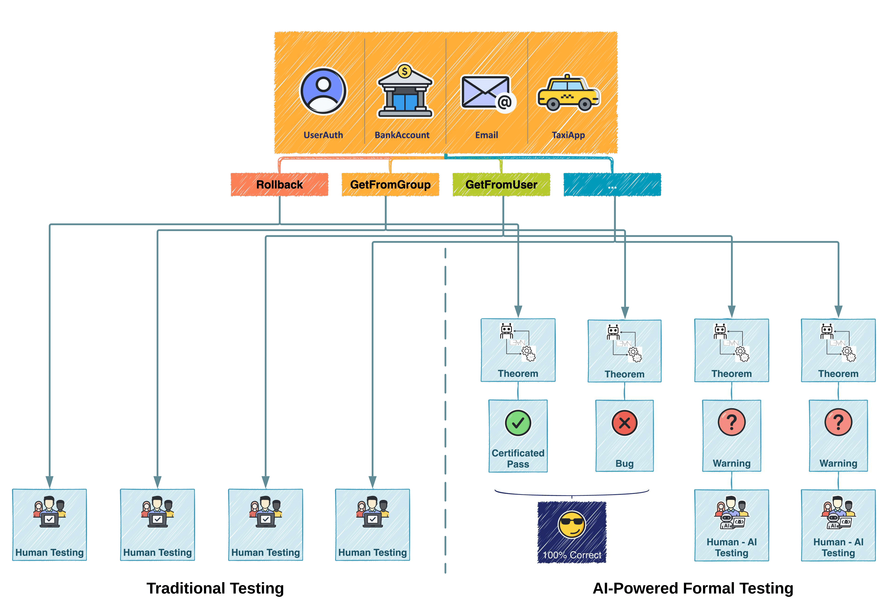
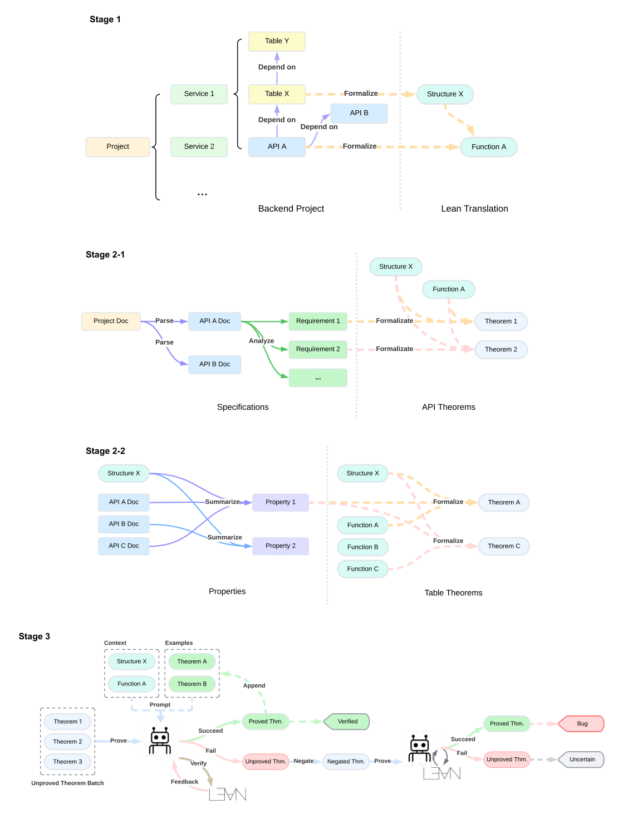

# Towards Automated Formal Verification of Backend Systems with LLMs
[](https://opensource.org/licenses/MIT) [](https://www.python.org/downloads/)

## Overview



This repo contains the code for the paper "Towards Automated Formal Verification of Backend Systems with LLMs".

Here is overview of the pipeline:



## Usage

### Environment Setup

In your environment:
```bash
pip install -r requirements.txt
```

### Inputs

The input to the pipeline is the source code of the project and the API doc of the project. All the example projects can be downloaded from [here](https://anonymous.4open.science/r/code-formal-verification-data-3837/), in the `source_code.zip` file.

Unzip and put the project source code in `source_code` folder (there should not be a nested `source_code` dir inside), the name of the top level dir will be the project name, make sure the name aligns with its subdirs:
- the code subdir (xxxCode)
- the doc dir (same as the project name)

Also an API doc file for the project is required, under the project dir
- `doc.md`

For example, if there is a `A` project in the `source_code` folder, its structure should be like
```
source_code
├── A
│   ├── ACode
│   ├── A
│   └── doc.md
```

The `ACode` codebase together with the table descriptions in yaml format inside the `A` dir will be used in the `formalization` pipeline to create the Lean project, and the `doc.md` will be used in the `theorem generation` pipeline, to generate the theorems for the APIs.


### LLM API Config
Put `config.json` in the `src/utils/apis` folder, the content is like
```json
{
    "backends": {
        "aliyun": {
            "base_url": "https://dashscope.aliyuncs.com/compatible-mode/v1",
            "api_key": "sk-xxxxxxxxx",
            "models": {
                "deepseek-chat": "deepseek-v3",
                "qwen-max-latest": "qwen-max-latest"
            }
        }
    },
    "models": {
        "gpt-4o-mini": ["azure-1"],
        "text-embedding-3-small": ["azure-1"],
        "deepseek-chat": ["aliyun"],
        "vllm": ["local-vllm"],
        "qwen-max-latest": ["aliyun"],
        "deepseek-r1": ["azure-1"]
    }
}
```

- The `backends` section is for the backend LLM providers, each with the base_url, api_key, and a mapping from the general model name in the `models` section to the specific model name that is used in the API call to the provider.
- The `models` section is for the general model names which is passed to the pipeline as parameters. The list of each model is for the activated backends.

An example config file can be found: `src/utils/apis/example_config.json`.

Call the model with the name in the `models` section.

### Lean Support

Make sure you have `lake` installed, and can use `lake build` to build the Lean project.
See the [Lean](https://lean-lang.org/lean4/doc/quickstart.html) documentation for more details.

### Optional: Check Proxy
Look at `run.sh` for the proxy settings.
If you don't need to use proxy, just comment out the settings.

### Run the pipeline
Three stages are defined in the pipeline:
- formalization
- theorem generation
- proof search

The stage to run is inside the `run_parallel.sh` script.
The project name is set inside the script or passed as a parameter, for example:
```bash
run_parallel.sh UserAuthentication
```

See `run_parallel.sh` for the usage of commonly used parameters.

Default to:
- model: qwen-max-latest
- prover-model: deepseek-r1
- project: UserAuthentication
- task: formalization

Detailed parameters can be found in the source code of each pipeline inside the `src/pipelines` folder.

You need to run formalization first, then theorem generation, and finally proof search to finish the pipeline.

## Code Structure

The `src/` dir contains the source code for the pipeline, in this structure:
```
src/
├── pipelines/
├── types/
├── formalize/
├── generate_theorems/
├── prove/
├── utils/
└── tools/
```

### Pipelines

The `pipelines/` dir contains the source code for the pipeline:
- `base.py`: the base class for the pipeline
- `formalize_pipeline.py`: the pipeline for the formalization stage
- `generate_theorems_pipeline.py`: the pipeline for the theorem generation stage
- `prove_pipeline.py`: the pipeline for the proof search stage
  
### Types

The `types/` dir contains the source code for the classes used in the pipeline:
- `project.py`: the class for the project, which is parsed from the source code, and records all the information of the input project and the generated Lean project, including the code, natural language descriptions, and theorems. The Lean project will be synthesized from the project instance.
- `lean_file.py`: the class for the Lean file, which is the basic unit in the Lean project. These structured can be converted to the Lean file content and write the corresponding file to the Lean project. The path to the file is also recorded in the instance. There are three types of Lean files:
  - `LeanStructureFile`: the class for the Lean structure definition file
  - `LeanFunctionFile`: the class for the Lean function implementation file
  - `LeanTheoremFile`: the class for the Lean theorem file
- `lean_manager.py`: A wrapper for the `lake` and `lean` commands, to init, modify, build the Lean project and process any errors to get structured feedback.
- `lean_structure.py`: A static class for the structure of the Lean project, including the path to the file and the import path. This class is used to set the path to each kind of file in the Lean project, so that determine the structure of the Lean project.

### Formalize

The `formalize/` dir contains the source code for the formalization stage:
- `init_project.py`: the function to init the Lean project from the source code and the doc.
- `table_dependency_analyzer.py`, `api_table_dependency_analyzer.py` and `api_dependency_analyzer.py`: the classes to analyze the dependency of the tables, APIs and the APIs on the tables.
- `table_formalizer.py`: the class to formalize the tables.
- `api_formalizer.py`: the class to formalize the APIs.

### Generate Theorems

The `generate_theorems/` dir contains the source code for the theorem generation stage:
- `api_requirement_generator.py`: the class to generate the requirements for the APIs. Including the API doc splitter and the requirement generator.
- `api_theorem_formalizer.py`: the class to formalize the theorems for the APIs.
- `table_property_analyzer.py`: the class to analyze the properties of the tables.
- `table_theorem_formalizer.py`: the class to formalize the theorems for the tables.

### Prove

The `prove/` dir contains the source code for the proof search stage:
- `api_theorem_prover_v2.py`: the class to prove the theorems for the APIs.
- `table_theorem_prover_v2.py`: the class to prove the theorems for the tables.
- `api_negative_theorem_generator.py`: the class to generate the negative theorems for the APIs.
- `table_negative_theorem_generator.py`: the class to generate the negative theorems for the tables.

The positive and negative theorems are both proved using the same prover. The provers without "v2" are the legacy version that uses conversation style to refine the proof, which may result in too long context for the reasoning model.

### Utils

The `utils/` dir contains:
- `apis/`: Support for LLM APIs, needs a `config.json` file to specify the LLM API providers and models.
- `lean/`: A parser tool for the output of `lake build`.

### Tools

The `tools/` dir contains extra tools for data processing or statistics.
- `generate_api_doc.py`: We can generate a fake API doc from the codebase if no predefined API doc is available. *But since the doc is created by reading the code, we cannot find bugs that the code misaligns with the doc in this way.* You can use this way to create a human-readable doc for the codebase and use the pipeline to guarantee the equivalence of the code and the doc.
- `theorem_analyzer.py`: A tool to analyze the theorems and the proof results given a json file which is the project structure dumped from the pipeline. You can refer to `analyze.sh` in the root dir for the usage.
